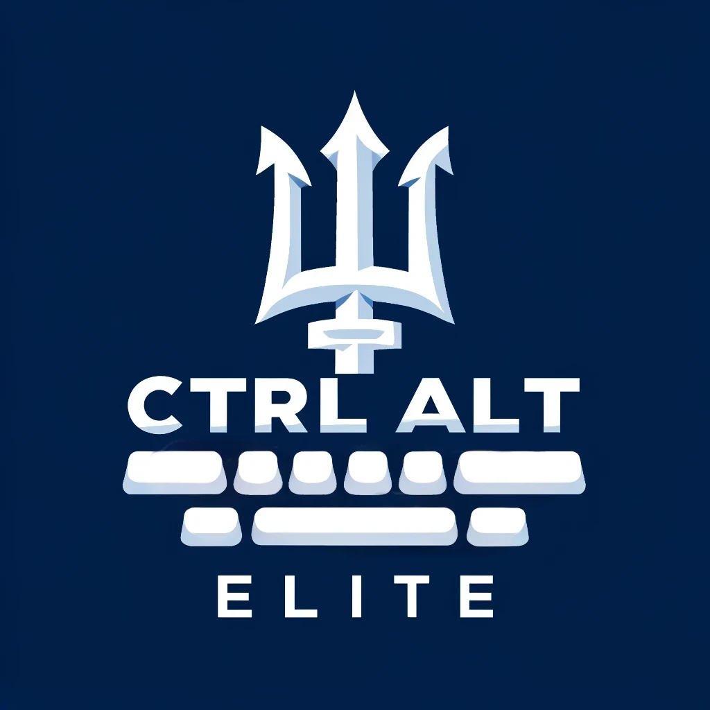

# cse110-sp24-group4

Team page for Team 4 Control Alt Elite

Team page Markdown file:
[Team Page](admin/team.md)

[Project documentation](./docs/README.md)

**Link to deployed project:** [DevDog](https://cse110-sp24-group4.github.io/cse110-sp24-group4/source/)

**Source**
All resources required for app functioning are located within the `/source` directory.

**Specs**
All ADRs, brainstorming docs, UI design docs, event model docs, HTML + CSS mockups, pitch docs, and techspecs including pseudocode are located in their respective subdirectories within `/specs`.

**Admin docs**
ADRs, team-related branding docs, ci pipeline descriptions, and meeting minutes are located in the `/admin` directory.