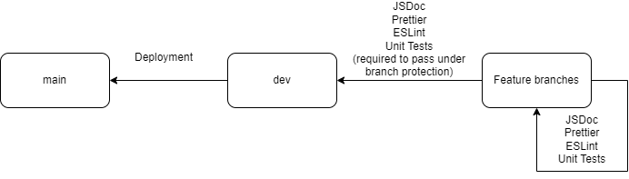

# Continuous Integration report for phase 1 of Ctrl Alt Elite's project

## What has been implemented

As of this report we have implemented 6 main elements of contiuous integration into our project. The elements are:

- Basic code style enforcement:
  Implemented using Prettier in GitHub Actions to enforce basic code style formatting such as replacing any tabs with spaces, removing unnecessary whitespace, correct line breaks, etc.
- Linting:
  Implemented using ESLint through GitHub Actions. Some additional configuration is still needed.
- Unit testing:
  Implemented using Jest. Currently unit tests will run on each push. They will also run on pull requests targeting the `dev` and `main` branches.
- Documentation Generation:
  Implemented using JSDoc as a GitHub Action. Additional documentation regarding repository structure, branch rules, etc. is also in the repo as `.md` documents
- Branch protection:
  Currently the `main` and `dev` branches are protected, requiring all status checks to pass before a feature branch is merged with them, as well as requiring a pull request that must be reviewed by at least one other person before a pull request is merged with `main`.

## Continuous Integration Pipeline diagram

## Planning

A deployment to GitHub Pages action is set up on the `main` branch that will automatically deploy the site upon release.

Some work to still be done is additional configuration of ESLint. More continuous integration may be needed to handle the case where we move the project toward a PWA.

We will likely move JSDoc to only run on pull requests targeting `dev` to improve workflow effeciency.
