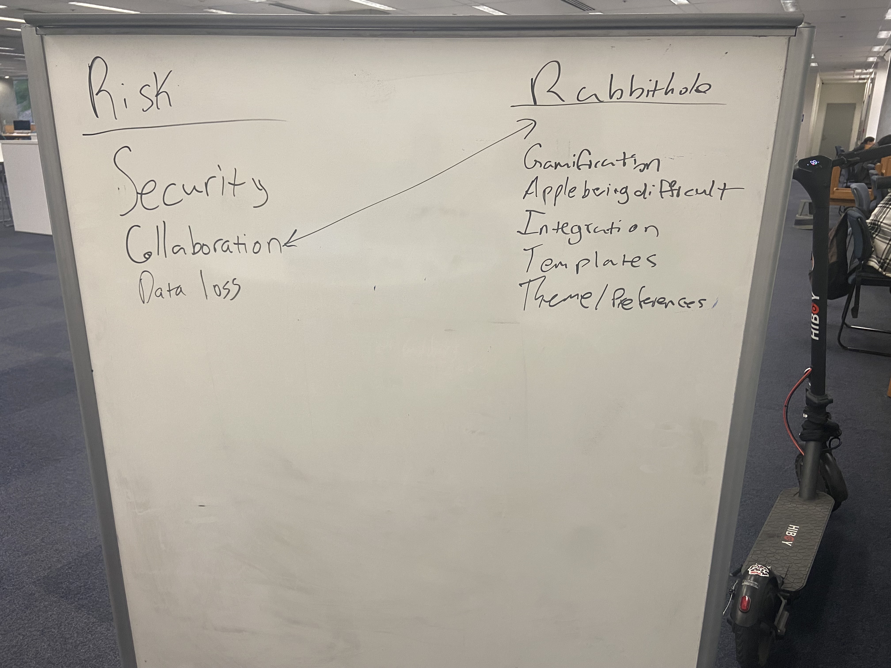
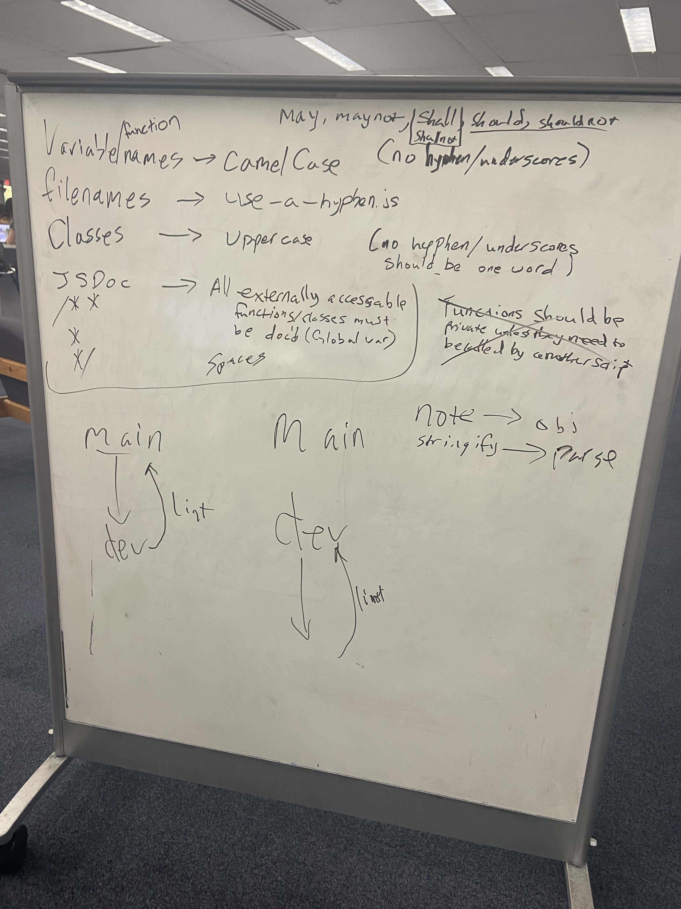
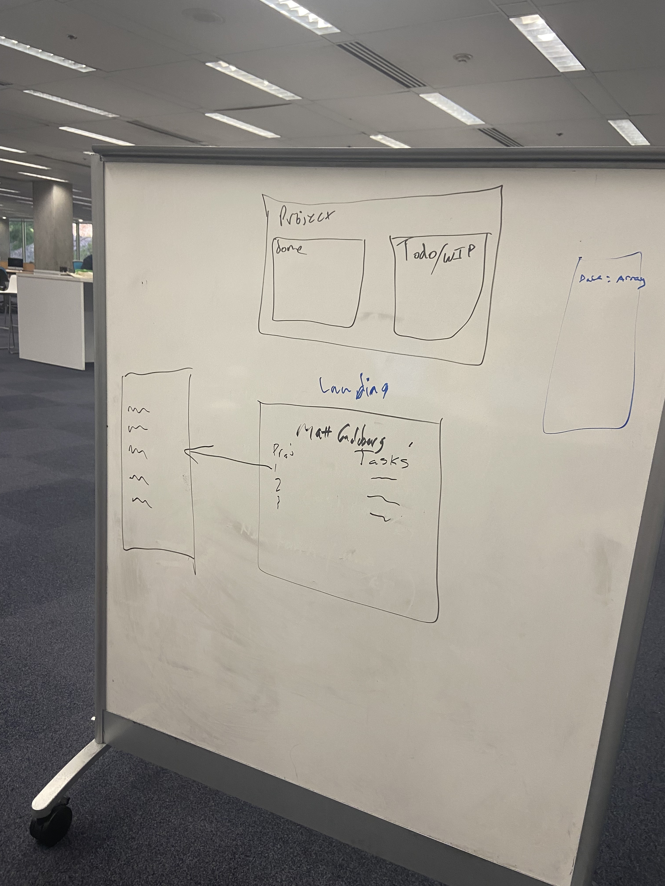

# Ctrl Alt Elite: Warmup Debrief Meeting   05/03/2024: 3:00pm - 5:00pm

## Members Present

### Topics

- Team member check-in
- Identify whiteboard tasks/teams
- User personas/stories
- App research
- UI/UX markup
- Possible features
- Style guide
- Brainstorm
- Confirm implementation
- Identify member(s) to write and submit pitch

#### Team Member Check-In

Team leads checked in with team members on any questions they had about the project. Project details were a little unclear so team leads pitched the problem statement "How can we keep track of the work we have done as developers?" and suggested the solution would be an app or website that could act as a dev diary/journal. Some ideas passed around were a journaling app, blog-style website, and an alphabet-soup style app where users could connect letter noodles to make notes. (The last one was presented more in the spirit that it is essentially up to the team in how they would like to tackle the problem).

#### Identify Whiteboard Tasks/Teams

The team decided on each member writing a user persona and story. Anushka, Gautham, and Matt took on app research. Daniel and Kekoa worked on pulling possible features from the user stories. Daniel and Joseph also worked on drafting a style guide. Kaye worked on designing some UI elements.

#### Brainstorm

The team collaborated on a miro whiteboard. The team also came up with some ideas about possible gamification to encourage adding notes or completing a task list. A mascot was identified, Milo the Golden, and some thought was given to the character of the site.

#### Confirming Implementation

The team decided to move forward with the blog-style site as the implementation for the project. Some ideas for naming the app were also added to the miro whiteboard

#### Risks and Rabbit Holes

The team identified some risks and rabbit holes and added them to the Miro whiteboard. The list is below:

- Security (User accounts adds extra concerns)
- Collaborative features
- Data loss
- Gamification
- Vendor-specific feature support
- Integration with outside apps/sites (i.e. GitHub, social media etc)
- Note page templates
- Theme

#### Starting Pitch

Matt and Daniel will write the pitch to be submitted Sunday night, May the 5th at 11:59PM.

#### Images and Links

[Miro Board](https://miro.com/app/board/uXjVKNdi5ig=/)

